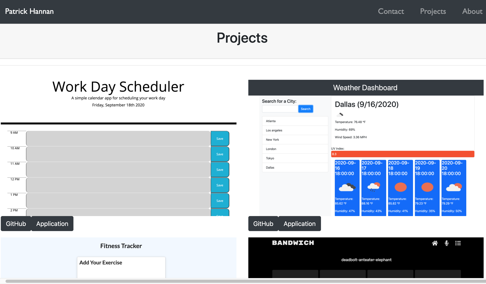

# React-portfolio

## Description 

This project is my personal porfolio with all of my personal information, contact information, and completed projects.

## Table of Contents

* [Usage](#usage)
* [License](#license)

## Usage 

This app requires no installation, simply view the app [here](https://patrickhannan.github.io/react-portfolio).

Use the navbar to update the page with what you want to see. The three pages are about me, contact info, and my best projects with links to the deployed app and the github repositories.

Below is a image of how the projects page, for example, will look.

## License

MIT License

Copyright (c) 2020 Patrick Hannan

Permission is hereby granted, free of charge, to any person obtaining a copy of this software and associated documentation files (the "Software"), to deal in the Software without restriction, including without limitation the rights to use, copy, modify, merge, publish, distribute, sublicense, and/or sell copies of the Software, and to permit persons to whom the Software is furnished to do so, subject to the following conditions:

The above copyright notice and this permission notice shall be included in all copies or substantial portions of the Software.

THE SOFTWARE IS PROVIDED "AS IS", WITHOUT WARRANTY OF ANY KIND, EXPRESS OR IMPLIED, INCLUDING BUT NOT LIMITED TO THE WARRANTIES OF MERCHANTABILITY, FITNESS FOR A PARTICULAR PURPOSE AND NONINFRINGEMENT. IN NO EVENT SHALL THE AUTHORS OR COPYRIGHT HOLDERS BE LIABLE FOR ANY CLAIM, DAMAGES OR OTHER LIABILITY, WHETHER IN AN ACTION OF CONTRACT, TORT OR OTHERWISE, ARISING FROM, OUT OF OR IN CONNECTION WITH THE SOFTWARE OR THE USE OR OTHER DEALINGS IN THE SOFTWARE.